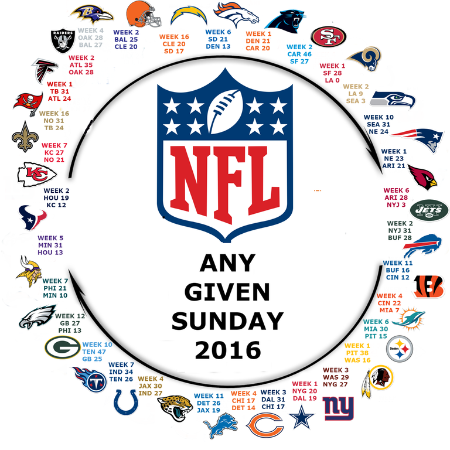

# Circle of Parity

## What is a "circle of parity"?

How can we prove that the in 2016, the Cleveland Browns (1-15) were better than the defending Super Bowl champs, the Denver Broncos?
With a little bit of creative abuse of inductive logic:

1. The Browns defeated the Chargers (their only win of the season) in week 16 
   - this implies that Browns > Chargers
2. The Chargers defeated the Broncos in week 6
   - this implies that Chargers > Broncos
   - --
3. Therefore, Browns > Chargers > Broncos

With a Circle of Parity, we can apply the same logic and "prove" that any team in the circle is better than any other team. In the 2016 example, we can also prove that the Broncos were better than the Browns.

Here is an example of a completed Circle of Parity:

## That looks like fun. How do we make one?

The good news: a Circle of Parity is likely to exist in any season of a sports league where 2 teams compete head-to-head in every match. For example: NFL, NHL, NBA, MLB, Premiere League, etc.

The bad news: It is not always easy to find it.

### The process

The short answer: starting with any given team, find a "victory streak" of other teams until a "streak" can be made that includes every team in the league.

For those of you familiar with graph theory, read the next section

### Graph Theory - Hamiltonian Cycle

We consider each team in the league as a vertex. They are connected with one-directional edges, each representing a win over another team in the season we are interested in. This is our "league season graph".

In this graph, we look for a [Hamiltonian cycle](https://en.wikipedia.org/wiki/Hamiltonian_path). In essence, we are looking for a **cycle** in the graph, where each vertex (team) is visited exactly once. 

Finding a Hamiltonian cycle (or determining if one exists) is an NP-complete problem. Luckily, most leagues do not have too many teams, and the computation time should not be too unreasonable, even with a slightly optimized brute-force algorithm.

